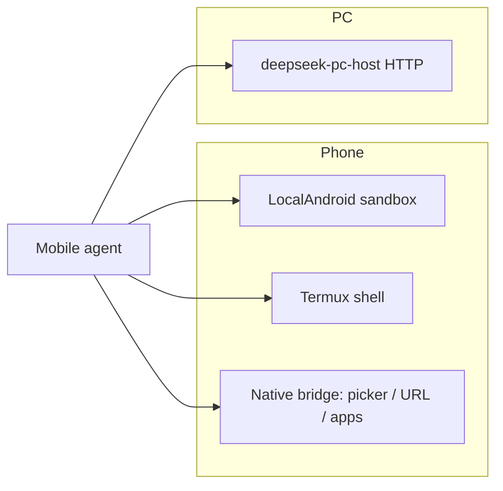

# Extended control roadmap (phone + PC «как Cursor здесь»)

This document is the **honest architecture plan** for moving from «coding agent with three channels» toward «control the whole phone and PC like the Cursor IDE agent in this chat». See also [CAPABILITY_MATRIX.md](./CAPABILITY_MATRIX.md) for what works today.

## What «like Cursor here» actually means

| Layer | Cursor IDE (this chat) | DeepSeek Mobile target |
|-------|------------------------|-------------------------|
| PC filesystem | Whole workspace + user-approved paths | **Today:** paired `deepseek-pc-host` workspace grant. **Next:** user-granted trusted paths + broader pc-host RPCs |
| PC shell | Integrated terminal, background processes | **Today:** `exec_shell` via gateway. **Next:** persistent sessions, `explorer`/OS open, multi-workspace |
| PC UI | Editor, panels, git UI | **Not goal:** replicate IDE UI — agent uses files/git/shell/MCP |
| Phone sandbox | N/A | **Today:** `read_file` / `write_file` under app storage |
| Phone shell | N/A | **Today:** Termux `RUN_COMMAND` when user configures path |
| Phone UI / apps | N/A | **Today:** `phone_control` (`open_url`, `share_file`, `launch_app`). **Next:** settings deep links, notifications, optional accessibility |

Full parity with Cursor Desktop is **not** a single feature — it is phased expansion of **executors** and **native bridges**, always bounded by OS security.

## Three executors (unchanged spine)

## Phase 1 — Shipped in this tranche

- **Pairing ZIP embeds `deepseek-pc-host`** when `tools/pc-host/bin` or `target/release` binaries exist (`discover_pc_host_binaries`).
- **Autostart helpers:** `scripts/install-pc-host-from-pairing.ps1` / `.sh` read `deepseek-pc-host.env` from the bundle.
- **`phone_control` tool:** `open_url`, `share_file`, `launch_app` → metadata → Android `NativeBridge` drain.
- **Settings trusted paths** (one per line) when External access = **Allowed by user grant** — wired into `ToolContext::resolve_path`.

## Phase 2 — PC breadth (4–8 weeks)

1. **pc-host RPC:** `list_dir` outside workspace when path is in server-side allowlist synced from phone settings.
2. **Open on PC:** `open_path` (explorer / xdg-open) scoped to workspace + grants.
3. **Persistent shell sessions** on pc-host (SSE already used for tasks — extend for terminal).
4. **mDNS + Tailscale** documented presets in Health panel.

## Phase 3 — Phone breadth (6–12 weeks)

1. **Termux:** document + wizard for `termux.properties` / permissions; queue status in Health.
2. **Intents:** `phone_control` actions `open_settings`, `send_notification` (with user approval).
3. **Optional Shizuku / ADB** (power users): separate opt-in module, never default — high risk, store policy.
4. **Accessibility service** (last resort): read-only UI tree for automation — requires explicit consent and Play policy review.

## Phase 4 — «One agent, many surfaces»

- **Cloud relay** (optional): phone talks to pc-host via tunnel when not on LAN — already sketched in `PcGatewayTransportMode::TunnelHttps`.
- **Shared task queue** across phone + PC (durable tasks crate) with single timeline in app.
- **MCP on PC host** proxy: phone invokes PC-installed MCP servers through gateway.

## Security principles (non-negotiable)

1. **Pairing token** only in ZIP/env — treat as password; short TTL optional.
2. **No silent full-disk access** on phone or PC — grants are visible in Settings.
3. **Plan mode** never executes tools (including `phone_control`).
4. **Approvals** for write/shell/network; `phone_control` uses Suggest/Required tier.

## How to test Phase 1 locally

1. `.\scripts\build-pc-host-bundles.ps1`
2. Export pairing ZIP from app → confirm zip contains `deepseek-pc-host.exe`.
3. Unzip on PC → `.\start-deepseek-pc-host.ps1` or `.\scripts\install-pc-host-from-pairing.ps1`
4. On phone, agent tool call: `phone_control` action `open_url` with app in foreground — browser opens.

## Decision: do we need «full phone UI automation»?

For **developer use**, Termux + `phone_control` + sandbox files cover 80% of cases (clone repo, run scripts, open GitHub Actions log in browser).

For **consumer-style «tap any app»**, Accessibility or ADB is required — defer until product commits to policy/legal review.

**Recommendation:** invest in **PC host + Termux + MCP** before phone UI automation.
