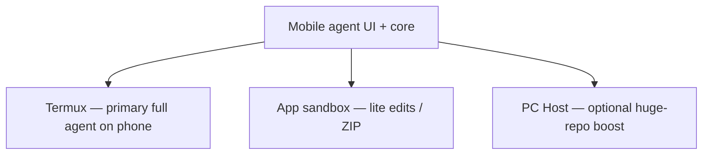

# Extended control roadmap (phone-first)

**Canonical positioning:** [PRODUCT_POSITIONING.md](./PRODUCT_POSITIONING.md)

This plan extends the **phone-first** agent (Termux = full executor on device). PC Host is **optional boost** for oversized projects, not the primary product path.

## Executors (priority order)

| Priority | Executor | Purpose |
|----------|----------|---------|
| 1 | **Termux** | Shell, git, build, test — **same role as desktop terminal in TUI** |
| 2 | **Local sandbox** | Safe storage, attachments, small edits without Termux |
| 3 | **PC Host** | When repo/tooling is too heavy for phone; finish work on workstation |
| — | **phone_control** | URLs, share sheet, launch app, settings — auxiliary |

## Phase A — Phone-first v1 (current focus)

1. **Termux happy path** — onboarding saves path, Settings validation, Health “Full agent ready”, device verification of RUN_COMMAND bridge. Android startup smoke is verified; Termux callback verification remains.
2. **TUI parity gaps on device** — MCP stdio on-device verification, file summaries / symbol search (see ROADMAP Phase 7–8). Large-output routing and multi-round tool follow-up are implemented in core.
3. **Default workspace policy** — `PreferTermux` for new installs; PC does not override Termux unless user activates PC workspace.
4. **phone_control** — `open_url`, `share_file`, `launch_app`, `open_settings`. *Shipped.*

## Phase B — Optional PC boost (already partially shipped)

Use only when the user opens **PC Host** panel or activates a PC workspace:

- Pairing ZIP + embedded `deepseek-pc-host`
- Trusted paths (`DEEPSEEK_PC_HOST_TRUSTED_PATHS`)
- `open_path` in OS file manager on PC
- Tasks / SSE / terminal on pc-host
- Autostart scripts (`install-pc-host-from-pairing.*`)

**Not** the default onboarding message (“you must pair PC to be pro”).

## Phase C — Later (explicitly not v1 core)

- Accessibility / Shizuku / ADB UI automation (opt-in, policy risk)
- Cloud relay / tunnel as default (LAN pairing is enough for v1)
- MCP proxy **only on PC** — nice-to-have; prefer **on-device MCP** first for phone-first parity

## Security (unchanged)

1. Pairing token = secret; short TTL optional.
2. Grants visible in Settings (trusted paths).
3. Plan mode never runs tools.
4. Approvals for shell/write/network.

## How to verify phone-first locally

1. Install Termux + `allow-external-apps=true` (see `docs/TROUBLESHOOTING.md`).
2. Onboarding or Settings → save valid Termux path → Health shows **Full agent ready**.
3. Agent mode → `exec_shell` with `pwd` / `git status` — timeline continues after Termux callback.
4. PC Host panel — **skip**; agent should still run full tools on Termux project.

## How to verify optional PC boost

1. `.\scripts\build-pc-host-bundles.ps1` → export pairing ZIP.
2. Start host on PC → activate PC workspace in app (user choice).
3. Run tests/git against PC project path.
